<h2>Who I am</h2>

<h2>Proof at a glance</h2>

<h2>Selected work</h2>

<a href="https://github.com/matheusaoliv/bicicletario-frontend"><code>bicicletario-frontend</code></a> ·
<a href="https://github.com/matheusaoliv/Portfolio---Matheus-Oliveira"><code>portfolio</code></a> ·
<a href="https://github.com/matheusaoliv/Pokedex-2.0"><code>pokedex-2.0</code></a> ·
<a href="https://github.com/matheusaoliv/Megapokedex"><code>megapokedex</code></a>

<h2>Technical toolkit</h2>

<h2>Consistency signal</h2>

<h2>Let’s talk about the next build</h2>

Open to thoughtful teams, ambitious products, and useful engineering work.

<a href="https://github.com/matheusaoliv"><b>GitHub</b></a> ·
<a href="https://github.com/matheusaoliv/Portfolio---Matheus-Oliveira"><b>Portfolio</b></a>

Live cards by <a href="https://www.gitskins.com/readme-generator">GitSkins</a> · hero, neofetch and heatmap are custom animated SVGs refreshed daily by GitHub Actions

<!--
Como funciona a parte animada:
- hero.svg, matheus-ascii.svg, info-card.svg e contrib-heatmap.svg têm a animação dentro do próprio SVG.
- scripts/make_hero_svg.py e scripts/make_info_card.py: edite os textos no topo de cada um.
- scripts/make_ascii_svg.py: gera a arte ASCII (aceita foto, veja scripts/prep_photo.py).
- .github/workflows/update-profile-art.yml: todo dia baixa as contribuições e regenera os SVGs.
-->
